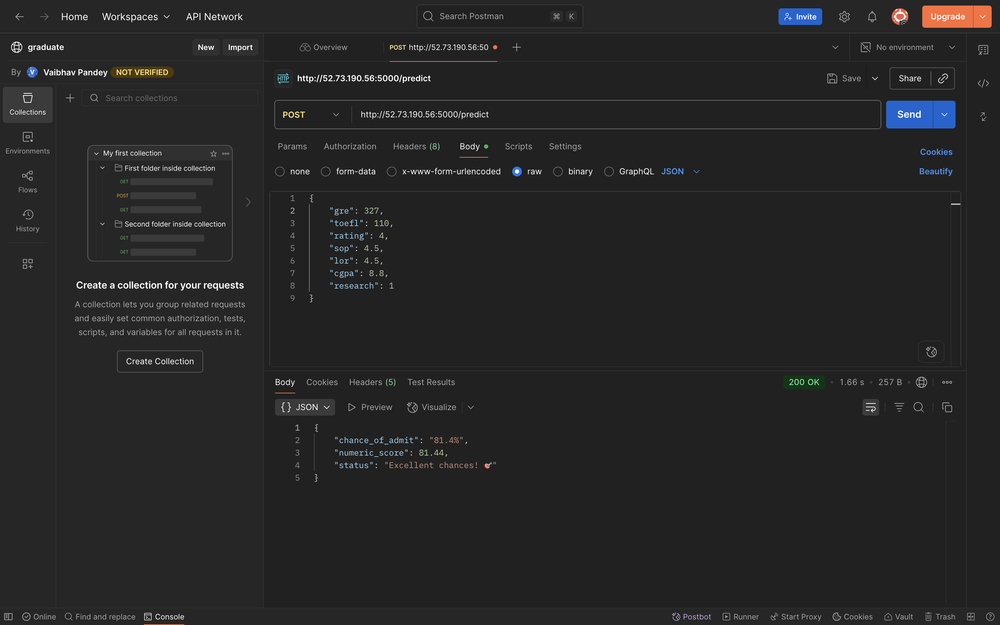

# 🎓 Graduate Admission Predictor

This project predicts the likelihood of graduate admission based on student profiles using Machine Learning.  
It covers the complete ML lifecycle: data preprocessing, model training, evaluation, Flask API development, Streamlit frontend, containerization, and CI/CD automation with AWS Fargate.

---

## 📌 Table of Contents
- [Problem Statement](#-problem-statement)
- [Tech Stack](#-tech-stack)
- [Project Workflow](#-project-workflow)
- [Model Training](#-model-training)
- [Streamlit Application](#-streamlit-application)
- [Web API Development](#-web-api-development)
- [Containerization](#-containerization)
- [AWS Deployment](#-aws-deployment)
- [CI/CD with GitHub Actions](#-cicd-with-github-actions)
- [How to Run Locally](#-how-to-run-locally)
- [Project Structure](#-project-structure)
- [Future Improvements](#-future-improvements)

---

## 🎯 Problem Statement
Predict graduate admission chances based on parameters such as GRE score, TOEFL score, SOP/Letter of Recommendation strength, CGPA, and research experience.  
The goal was to build a reliable ML model and deploy it as a production-ready API with a web UI.

---

## 🛠 Tech Stack
- **Languages:** Python 3.9
- **Frameworks/Libraries:**
  - `scikit-learn`, `numpy`, `pandas`, `matplotlib`
  - `Flask` (Web API)
  - `Streamlit` (Frontend UI)
- **Model Saving:** `pickle`
- **Containerization:** Docker
- **Cloud:** AWS ECS (Fargate), ECR, IAM
- **CI/CD:** GitHub Actions
- **Other Tools:** VS Code, Git

---

## 🔄 Project Workflow
1. **Data Preprocessing & EDA**
   - Cleaned and normalized dataset.
   - Performed exploratory analysis to identify key factors affecting admission.

2. **Model Development**
   - Trained multiple ML models (Linear Regression, Decision Tree, Random Forest, etc.).
   - Evaluated performance using R², MSE, RMSE.
   - Selected **Linear Regression** as the best model.
   - Saved model and scaler using `pickle`.

3. **Streamlit Application**
   - Built an interactive frontend for real-time predictions.
   - Students can input scores and instantly see admission probability (%).

4.  **Web API Development**
   - Built a **Flask REST API** to serve predictions.
   - API accepts student profile data (GRE, TOEFL, CGPA, Research, SOP, LOR).
   - Returns predicted admission probability as JSON.

5. **Containerization (Docker)**
   - Created a `Dockerfile` to containerize both Flask API and Streamlit app.
   - Ensured reproducibility using `requirements.txt`.

6. **AWS Deployment**
   - **ECR** for Docker image storage.
   - **ECS with Fargate** for serverless container execution.
   - Configured IAM roles and policies for secure deployments.
   - Automated GitHub → AWS deployment pipeline.

7. **CI/CD with GitHub Actions**
   - Automated workflow to:
     - Run tests (`pytest`).
     - Build Docker image.
     - Push image to **AWS ECR**.
     - Deploy container to **AWS ECS (Fargate)**.

---

## 📊 Model Training
- Implemented in `admn_pred.ipynb`.
- Applied preprocessing (feature scaling, normalization).
- Tested different algorithms.
- Final Model: **Linear Regression** with best accuracy.
- Metrics: R², MSE, RMSE.
- Exported model as `best_model_lr.pkl`.

---


## 💻 Streamlit Application
- **File:** `app.py`
- **Features:**
  - User inputs GRE, TOEFL, CGPA, SOP, LOR, Research.
  - Transforms input with trained scaler.
  - Displays admission probability (%) in UI.

 ---

## 🌐 Web API Development
- **File:** `graduate.py`
- Endpoints:
  - `/predict` → Accepts JSON input and returns admission probability.
- Example Request:
  ```json
  {
    "GRE": 320,
    "TOEFL": 110,
    "CGPA": 8.9,
    "SOP": 4.5,
    "LOR": 4,
    "Research": 1
  } 
   ```
  ---

  ## 🐳 Containerization
- **Dockerfile:**
  - Installs dependencies.
  - Runs Flask API and Streamlit app in container.
- **requirements.txt** ensures consistent environments.

---

## ☁️ AWS Deployment
- **AWS ECR**: Stores Docker images.
- **AWS ECS (Fargate)**: Runs containers serverlessly.
- **IAM Roles & Policies**:
  - `AmazonECS_FullAccess`
  - `AmazonEC2ContainerRegistryFullAccess`
  - `IAMFullAccess` (setup)
 
---

## ⚙️ CI/CD with GitHub Actions
- **Workflow:** `.github/workflows/automate.yml`
- **Pipeline steps:**
  1. Setup Python
  2. Install dependencies
  3. Run tests
  4. Build Docker image
  5. Push to **AWS ECR**
  6. Deploy to **ECS Fargate**
- Fully automated CI/CD: GitHub push → ECS deployment.

---

## ✅ API Testing on AWS (Flask Web API)

The model was deployed successfully on **AWS ECS Fargate**.  
The Flask Web API exposes a `/predict` endpoint where users can send a **POST request** with student details (GRE, TOEFL, SOP, LOR, CGPA, Research, etc.) to get admission predictions.

The deployment was verified using **Postman**, as shown below:



- The request body includes student profile details in JSON format.  
- The response returns:  
  - `chance_of_admit` (%)  
  - `numeric_score`  
  - `status` (interpretation of chances)

This confirms that the model is live and accessible through AWS-generated public IP.

---

## 📂 Project Structure  
```plaintext
graduate_admission_predictor/
│── admn_pred.ipynb           # Model training & evaluation
│── app.py                    # Streamlit frontend
│── graduate.py              # Flask Web API
│── best_model_lr.pkl         # Saved model
│── requirements.txt          # Dependencies
│── Dockerfile                # Containerization
│── .github/workflows/        # GitHub Actions CI/CD

```
---

## 🚀 How to Run Locally

1. **Clone the repository**
   ```bash
   git clone https://github.com/your-username/Graduate_admission_predictor.git
   cd Graduate_admission_predictor
   ```

2. **Create a virtual environment & install dependencies**
```bash
python3 -m venv venv
source venv/bin/activate
pip install -r requirements.txt
```
3. **Run Flask API**
```bash
python graduate.py
```
4. **Run Streamlit app**
```bash
streamlit run app.py
```

## 🚀 Future Improvements

- Enhance model using **XGBoost/LightGBM**.  
- Add Explainability with **SHAP** / **LIME**.  
- Extend API with **user authentication**.  
- Deploy frontend + backend as **microservices**.  
- Add monitoring with **AWS CloudWatch**.  
